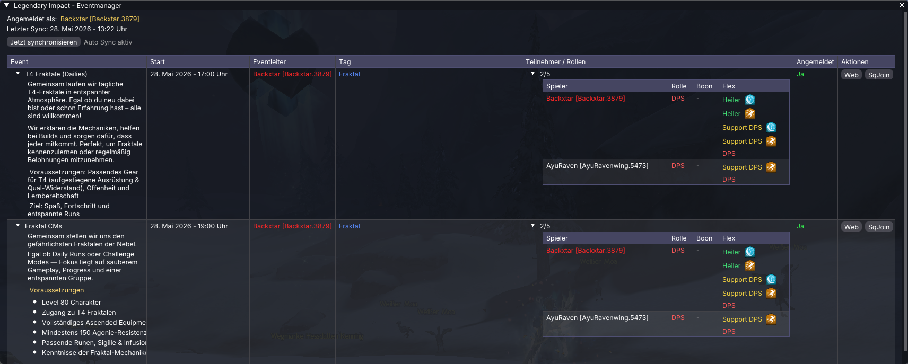

# Legendary Impact - Eventmanager

<p align="center">
  
</p>

<p align="center">
  Modern Guild Wars 2 event management directly inside Nexus.
</p>

<p align="center">
  
  
  
</p>

## Overview

Legendary Impact - Eventmanager is a Nexus addon for Guild Wars 2 that integrates Legendary Impact event management directly into the game.

The addon provides event synchronization, reminders, attendee overviews, role compositions, quick squad interaction features, and direct event browser access.

## Features

| Feature | Description |
|---|---|
| Event Synchronization | Automatic synchronization with Legendary Impact |
| Event Overview | View upcoming events directly ingame |
| Reminder System | Notifications before event start |
| Attendee Overview | Display attendees, roles, and boon compositions |
| Squad Join Support | Quickly copy `/sqjoin` commands |
| Browser Integration | Open events directly in the browser to sign up |
| Markdown Rendering | Render formatted event descriptions |
| Quick Access | Integrated Nexus Quick Access support |
| Modern Architecture | Built with modern C++20 |

## Requirements

| Requirement | Version |
|---|---|
| Guild Wars 2 | Latest |
| Nexus Addon Loader | Required |
| Operating System | Windows x64 |

## Installation

1. Download the latest release
2. Extract the addon into:

```text
Guild Wars 2/addons/
```

3. Launch Guild Wars 2
4. Open Nexus
5. Enable `Legendary Impact - Eventmanager`

## Configuration

The addon can be configured directly inside the Nexus options menu.

### Available Settings

| Setting | Description |
|---|---|
| Legendary Impact Token | API authentication token |
| Auto Sync Interval | Automatic synchronization interval |
| Reminder Settings | Configure event notifications |
| Window Visibility | Toggle addon window |
| Keybind | Configure window toggle key |

## Default Keybind

```text
F8
```

The keybind can be changed inside the Nexus keybind settings.

## Technologies

| Technology | Purpose |
|---|---|
| [C++20](https://en.cppreference.com/w/cpp/20) | Core implementation |
| [Nexus API](https://github.com/RaidcoreGG/Nexus) | Addon integration |
| [ImGui](https://github.com/ocornut/imgui) | User interface |
| [WinHTTP](https://learn.microsoft.com/en-us/windows/win32/winhttp/about-winhttp) | HTTP communication |
| [nlohmann/json](https://github.com/nlohmann/json) | JSON parsing |

## Building

### Recommended Environment

| Tool | Version |
|---|---|
| Visual Studio | 2022 |
| C++ Standard | C++20 |

### Compiler Settings

```text
/std:c++20
/permissive-
```

## Credits

| Name | Contribution |
|---|---|
| [Backxtar](https://gitlab.com/) | Development |
| [Raidcore](https://github.com/RaidcoreGG) | Nexus Framework |
